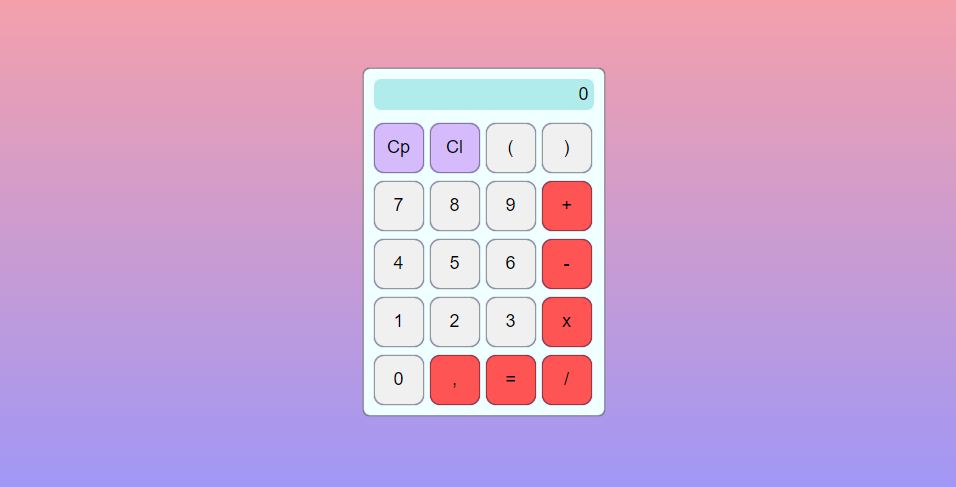

# Simple JavaScript Calculator

This is a simple calculator developed using HTML, CSS, and JavaScript. It allows performing basic operations such as addition, subtraction, multiplication, and division.

## Features

- Addition, subtraction, multiplication, and division of numbers.
- Calculations using the "equals" button or by pressing the "Enter" key.
- Clearing the display using the "C" button.
- Deleting the last entered character using the "Backspace" key.

## How to Use

1. Open the `index.html` file in your web browser.
2. Use the number buttons to input desired numbers.
3. Use the operation buttons to perform calculations.
4. Press the "C" button to clear the display.
5. Press the "equals" button or the "Enter" key to get the calculation result.

## Technologies Used

- HTML5
- CSS3
- JavaScript

## GitHub Pages

This project is hosted on GitHub Pages. Click [here](https://johanpq.github.io/Calculator/) to view it.

## Author

This project was developed by [Johan Queiroz].

## Contribution

Contributions are always welcome! Feel free to open an issue or submit a pull request with improvements.

## License

This project is licensed under the [MIT License](LICENSE).
